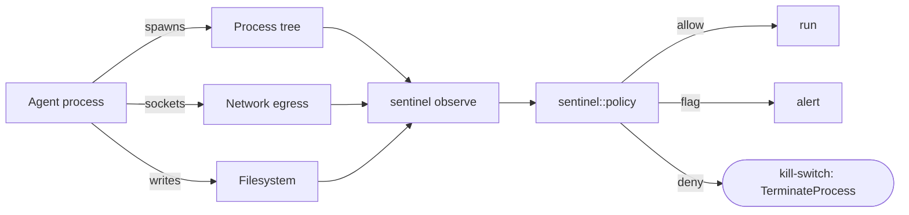

# sentinel

[](https://github.com/JUS7205/sentinel/actions/workflows/ci.yml)

> An anti-cheat engine for AI agents. Runtime behavioral guard — not a prompt filter.

The industry ships prompt-level filters. The real attacks against autonomous
agents — prompt injection → silent exfiltration, tool-output poisoning,
agent hijack — live in **runtime behavior**, not text. Sentinel applies
anti-cheat / EDR discipline to agents: it watches an agent's process tree,
network, and filesystem at runtime and enforces a policy, with a kill-switch.

This is a work in progress. What exists today is real, compiling, and tested:
a process-tree observer (Phase 0), a PID-attributed network observer (Phase 1),
and a filesystem watch + static policy engine with a kill-switch (Phase 2).

## Status

| Phase | Scope | State |
|-------|-------|-------|
| 0 — Spike | Cross-platform process-tree enumeration (Windows + Linux) | ✅ done, tests green |
| 1 — Observe | Network connection enumeration (Windows `GetExtendedTcpTable`, PID-attributed) + `observe` CLI emitting JSON | ✅ done, tests green |
| 2 — Enforce | Filesystem watch, static policy engine, `enforce` CLI with Windows kill-switch (`TerminateProcess`) | ✅ done, tests green |
| 3 — MVP | Python agent adapter, Next.js dashboard (live threat graph + kill button), anomaly baseline | 🟡 next |
| 4 — v1 | Behavioral anomaly baseline, session replay, auto-containment, multi-agent | ⚪ planned |
| 5 — stretch | ML anomaly detection, autonomous red-team loop, eBPF/Win32 parity | ⚪ planned |

## What the code does (today)

`tree_for(pid)` returns the full process subtree rooted at `pid`, on both
Windows and Linux, behind one API:

```rust
use sentinel::tree_for;

let pid = std::process::id();
let tree = tree_for(pid).expect("current pid should be observable");
println!("this agent spawned {} process(es) total", tree.size());
tree.walk(&mut |p| println!("  pid {}: {}", p.pid, p.name));
```

- **Windows** — `CreateToolhelp32Snapshot` + `Process32First/Next` (user-mode,
  no admin). Process names resolved via `K32EnumProcessModules`.
- **Linux/macOS** — `/proc/<pid>/status` parsing (`PPid`, `Name`).
- The watchdog (`ProcessTree::all()`) enumerates the whole host forest.

The same primitive an anti-cheat engine uses to map a target is the first
thing a runtime guard needs before it can watch what an agent *does*.

## Phase 1 — runtime connections

`sentinel observe <pid>` composes the process tree with the connection table
and emits a machine-readable JSON snapshot a dashboard or policy engine can
consume. Connections are attributed to PIDs via `GetExtendedTcpTable` — the
same call a firewall/EDR uses to ask *why is this agent holding an outbound
socket to an unknown host?*

```bash
cargo run --bin sentinel-cli           # observe self
cargo run --bin sentinel-cli <pid>     # observe a target agent
```

```json
{
  "pid": 8656,
  "observed_at": "1784310400",
  "process_tree": { "pid": 8656, "name": "agent.exe", "children": [] },
  "connections": [
    { "pid": 8656, "local_addr": "192.168.0.159:63869",
      "remote_addr": "32.195.92.226:443", "state": "ESTABLISHED" }
  ]
}
```

On this Windows host the observer correctly resolves live connections
(including external `ESTABLISHED` sockets) to their owning PID. The Linux
connection path is scheduled for Phase 1 parity; until then it returns an
empty list rather than fabricated data.

## Phase 2 — policy + kill-switch

`sentinel enforce <pid> --policy policy.json` evaluates a declarative policy
against the live snapshot and, on `deny`, triggers the kill-switch (Windows:
`TerminateProcess` on the watched root). The engine is pure and unit-tested:
a `Snapshot` in, a `Verdict { allow | flag | deny, reasons }` out.

```bash
cargo run --bin sentinel-cli enforce <pid> --policy policy.deny.json
```

```json
{
  "pid": 2,
  "verdict": "allow",
  "reasons": [],
  "kill_switch": false
}
```

Rules are data, not code — `policy.deny.json` (in-repo) flags external egress,
blocklisted hosts, credential writes, and known-bad binaries. The filesystem
watch (`fs::scan_dir` + `fs::diff`) detects new/modified files under watched
paths and marks credential drops (`.env`, `id_rsa`, `*.pem`, …) as sensitive.

## Build & test

```bash
cargo build
cargo test      # 15 tests, green on Windows
```

Requires Rust 1.74+. On Windows, the `windows-sys` feature set pulls the
Toolhelp, Process Status, IP Helper, and Threading APIs.

## Architecture (target)



```text
sentinel-observer   (Rust)  — process/network/fs observation  ◀ today: all three
sentinel-policy     (Rust)  — declarative rules + anomaly baseline → allow/flag/deny
sentinel-agent      (Py)    — wraps an agent's tool-call layer, enforces verdicts
sentinel-dash       (Next)   — live threat graph, kill-switch, session replay  ◀ ghostkit
```

Local heuristic scoring uses a Qwen 3B model served via `llama_cpp.server`.

## Principles

- **Real before pretty.** Every module ships compiling and tested.
- **Runtime, not text.** Behavior is the attack surface.
- **Gold-only.** No committed databases, configs, or boilerplate.

## License

Apache-2.0 + Commons Clause. Commercial rights reserved to the copyright
owner — you may use/modify/host it freely for non-commercial purposes and as a
capability showcase, but may not sell it or a product derived from it without a
commercial license (see LICENSE).
